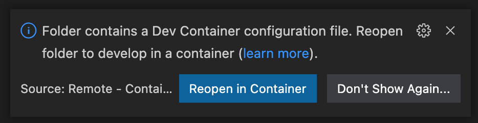

## **Backend Service for the NEAR DevConsole**

# Stack

Language: Typescript

Framework: [NestJS](https://nestjs.com/)

ORM: [Prisma](https://www.prisma.io/)

Identity Management: [Firebase Auth](https://firebase.google.com/docs/auth)

# Quickstart

The recommend way to run this project is with VS Code and Dev Containers.

> The Visual Studio Code Remote - Containers extension lets you use a Docker container as a full-featured development environment. It allows you to open any folder inside (or mounted into) a container and take advantage of Visual Studio Code's full feature set.

This will create a set of Docker containers with all required dependencies preconfigured by the DevConsole team.

1. Follow the [official Installation instructions](https://code.visualstudio.com/docs/remote/containers#_installation) from VS Code to install Docker and the required extensions
2. Open this directory in VS Code
3. If prompted in the bottom right with the pictured message, click "Reopen in Container".
     
   Otherwise, open the VS Code command palette and run `Remote-Containers: Reopen in Container`.
4. Wait for the build process to complete. You will now have two connected Docker containers running. One is your Node+Typescript development environment and one is a Postgres instance. Your files are mounted into the Node+Typescript container, so edits made through VS Code apply to the files on your local filesystem
5. Open an in-editor terminal by selecting `Terminal > New Terminal` from the Menu Bar
6. Run `npm install` to install dependencies
7. Run `npx prisma migrate dev` to initialize the database
   Note: this must be ran from a directory containing a prisma folder (e.g. `src/core` or `src/modules/alerts`).
8. Choose `Run > Start Debugging` or hit F5 to run the server in live-reload mode with breakpoint debugging enabled!
9. Your server is available at `localhost:3001`. VS Code will automatically expose the port from the Dev Container to the rest of your machine. Test that it is available by running `curl -X GET localhost:3001` from a terminal outside of the Dev Container

> Note: The default resource allocations for Docker are relatively low. If you plan to continue using VS Code Dev Containers,
> it is recommended to raise them significantly in Docker Desktop's preferences so that your development environment can benefit
> from the full power of your machine

# Usage

## ngrok

If you need to expose your API beyond your local machine—e.g. to test the frontend on a mobile device—you can use `ngrok`. The DevConsole team has a shared account.

More details [here](https://nearinc.atlassian.net/wiki/spaces/DEVCONSOLE/pages/36438083/Onboarding)

### Update models

Whenever models are changed, even locally, a new Prisma client must be generated

```
npx prisma generate
```

> The `prisma generate` command reads your Prisma schema and updates the generated Prisma Client library inside `node_modules/@prisma/client`.
>
> This results in the imported Prisma Client having proper TypeScript support for
> your schema.

## Running the app

### VS Code

This repo includes a `.vscode/launch.json` which configures a debugging profile with breakpoint support. You can
user _Run > Start Debugging_ from the Menu Bar or the default keybing of F5. This runs in live-reload mode

### Other

```bash
# run in watch mode to live-reload on changes
$ npm run start:dev

# run in development without live-reload
$ npm run start
```

## Debugging

If using VS Code, you can copy the [devResources/launch.json](devResources/launch.json) file to your `.vscode` directory to get a working debugging configuration. Hit F5 to run it and use breakpoints in the gutter of the editor window

# Contributing

The recommended way to run a development instance of this project is with VS Code and Dev Containers. The container definitions are part of this repository (`.devcontainer/`), so using dev containers will allow you to easily keep your environment in sync with other team members.

If VS Code is not your preferred development environment, you are more than welcome to stray from this recommendation and run the containers with Docker directly.

> TODO: Define a docker-compose stack for running without VS Code

## Modules

DevConsole consists of multiple modules owned by different teams within Pagoda. Each module has isolated directories within this repository for their work, and should refrain from touching files outside those directories.

A module should be fully contained in `/src/modules/{module}`. These module folders are [NestJS modules](https://docs.nestjs.com/modules).

Module folders are instantiated with some helpful defaults.
[Prisma](https://www.prisma.io/) is chosen as the ORM and is contained within the `prisma` folder which contains a schema file, `schema.prisma`, and a `migrations` folder.
An empty NestJS module will be created with a basic HTTP controller and empty service and test files.
`dto.ts` can be used to store request and response objects used to communicate with the client.

The module folder is entirely owned by the module team to use as they see fit (i.e. code organization may differ between modules).

### Generating a New Module

Start by running `npm run gen:module {name}` replacing `{name}` with a name that best describes your module. This will generate a new folder under `src/modules`.

Next, you can:

- update `schema.prisma` with database models and review our [database section](#database) on how to upgrade your database
- update `{name}.controllers.ts` with API routes
- update `{name}.service.ts` with methods that interact with your database / Prisma client
  - update `{name}.module.ts` by including `PrismaService` from `prisma.service.ts` to the `imports` and `providers` list (`projects.module.ts` for an example). This will instantiate your Prisma client and connect to your database during runtime.

Check out `./src/projects` for inspiration on how to further organize your module.

## Git inside Dev Container

On Mac, you need to load your SSH key into ssh-agent in order for VS Code to make it available in your Dev Container. From a terminal outside the Dev Container, run

```
ssh-add <private key path>
```

e.g. `ssh-add ~/.ssh/id_rsa`

After that, git commands from the integrated terminal should be able to use your SSH key to communicate with GitHub.

## Endpoints

This is an RPC-style API. All endpoints are POSTs and all bodies are JSON. This style was chosen since the API is serving a specific frontend client and set of features.

## Input Validation

All endpoints which accept input (JSON bodies) should validate that input with [Joi](https://joi.dev/). The best way to learn how to do this is to inspect an existing endpoint.

## Authentication

Users tokens are verified with Firebase in [src/core/auth/auth.service.ts](src/core/auth/auth.service.ts). The authenticated user details are attached in the request object and accessible in endpoint handlers as seen below

```ts
@Post('exampleHandler')
@UseGuards(BearerAuthGuard)
async exampleHandler(@Request() req) {
  console.log(req.user);
}
```

## Configuration

All configuration relies on environment variables.

See [./src/core/config/validate.ts](./src/core/config/validate.ts)

Always set the type of ConfigService in the constructor and use `{infer: true}` in getter for proper typing and nested access

constructor example:

```ts
private config: ConfigService<AppConfig>
```

getter example:

```ts
this.config.get('analytics.url', { infer: true });
```

In the future, the need to add infer to ever call could be removed by extending `ConfigService` [as suggested by a contributor](https://github.com/nestjs/config/issues/636#issuecomment-889168693)

### Local Config

During local development, Nest loads environment variables from dotenv files. There are three to use

`.env.nest`  
Default and nonsensitive environment variables. This is tracked in git so that when new config values are added other developers do not need to manually make changes on their end.

`.env.nest.local`  
Secrets and overrides. Easily override defaults from `.env.nest` by defining a different value for that variable in `.env.nest.local`. Not tracked by git so secrets aren't leaked and you don't constantly create diffs when changing values for your own dev purposes. To start, copy `.env.nest.local.example` to `.env.nest.local` and ask a fellow developer for existing secrets.

`./src/core/prisma/.env`
Prisma loads this file using dotenv. Both PrismaClient and CLI will use this file.

Note: PrismaClient loads its `.env` file first before NestJS ConfigService. Make sure you don't have conflicting key names between the `./src/core/prisma/.env` and `.env.nest` or `.env.nest.local` files!

## Comments

Where helpful, utilize [Better Comments](https://marketplace.visualstudio.com/items?itemName=aaron-bond.better-comments) syntax to add context to your comments.

## Errors

This project uses [VError](https://github.com/joyent/node-verror). All errors should be instances of VError. Errors thrown should propagate any lower level causes.

e.g.

```ts
function executeCommand() {
  throw new VError('Something went wrong');
}

function process() {
  try {
    executeCommand();
  } catch (e) {
    throw new VError(e, 'Failed while executing command');
  }
}
```

to get an error message like

```
Failed while executing command: Something went wrong
```

### Converting to client response

A metadata property named `code` should be used to identify known errors so that the controller can map them to an appropriate HTTP response.

e.g.
In a service

```ts
// assuming a query was just performed that determined a user does not have permission to perform the action they attempted
throw new VError(
  { info: { code: 'PERMISSION_DENIED' } },
  'User does not have rights to perform action X',
);
```

then, in the controller

```ts
switch (VError.info(e)?.code) {
  case 'PERMISSION_DENIED':
    throw new ForbiddenException();
  default:
    // 500 server error
    throw e;
}
```

which sends the client

```json
{
  "statusCode": 403,
  "message": "Forbidden"
}
```

This allows us to easily handle known errors at the controller level even though the originating error may have been wrapped by several VErrors in between.

> This example chooses not to display a custom error message to the client, but that can be accomplished in the controller if desired.
